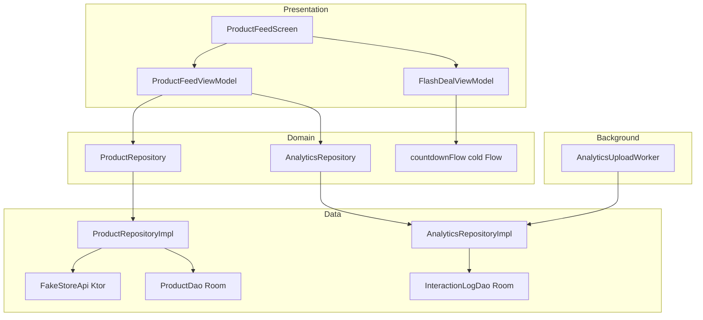

# AmirAssignment — Marketplace Engine

Android app that simulates a dynamic marketplace: offline-first product catalog (Fake Store API + Room), flash-deal countdown, and background analytics upload via WorkManager.

## Architecture



| Package | Role |
|---------|------|
| `di` | Hilt modules (network, Room, repositories) |
| `data.remote` | Ktor client, Fake Store API, DTOs |
| `data.local` | Room entities, DAOs, database |
| `data.repository` | Offline-first product repo, analytics repo, `RemoteMediator` |
| `domain` | Models, repository interfaces, flash countdown flow |
| `ui.feed` / `ui.flash` | Compose screens and ViewModels |
| `worker` | Periodic analytics upload |

## Room caching strategy

- **Single source of truth:** The UI reads products from Room via Paging (`ProductDao.pagingSource`), never directly from the network.
- **Network refresh:** `ProductRemoteMediator` pages Fake Store (`limit`/`skip`), upserts into `products`, and stores pagination keys in `remote_keys`. Pull-to-refresh triggers Paging refresh and an optional full snapshot via `refreshProducts()`.
- **Offline:** Cached rows remain queryable when offline; errors surface as snackbars while cached cards stay visible.
- **Analytics:** Interaction events go to a separate `interaction_logs` table immediately; WorkManager batches unsynced rows to a mock admin endpoint.

## Synthetic inventory

Fake Store JSON has no stock field. Inventory on each card is derived as `(120 - id * 3).coerceIn(1, 99)` for stable demo values.

## Setup

1. **Requirements:** Android Studio (latest), JDK 11+, Android SDK 36, emulator or device API 24+.
2. Clone the repository and open the project in Android Studio.
3. Sync Gradle and run the **app** configuration on an emulator with internet for the first catalog sync.
4. CLI build:
   ```bash
   ./gradlew assembleDebug
   ```

## WorkManager (analytics upload)

- Scheduled every **15 minutes** with **unmetered Wi‑Fi** and **charging** required.
- To exercise on an emulator: enable Wi‑Fi (unmetered), plug in charging, then use:
  ```bash
  adb shell cmd jobscheduler run -f com.example.amirassignment 0
  ```
  (Job id may vary; Android Studio App Inspection → Background Work is helpful.)

## Tests

```bash
./gradlew testDebugUnitTest
```

Covers ViewModel state, repository refresh caching, Room interaction log DAO (Robolectric), and countdown formatting.

## Troubleshooting

### Hilt: `Could not get element for AmirApplication_GeneratedInjector`

This project uses **AGP 9 built-in Kotlin** with **Hilt + KSP**. If you see a `NullPointerException` in `AggregatedDepsMetadata` / `ComponentTreeDepsProcessingStep`, ensure [`app/build.gradle.kts`](app/build.gradle.kts) contains:

```kotlin
hilt {
    enableAggregatingTask = false
}
```

Do **not** pass `dagger.hilt.enableAggregatingTask` via `ksp { arg(...) }` (Hilt 2.59 rejects it as an unknown option).

Then **Build → Clean Project**, close other Gradle/Android Studio builds, and run **Rebuild Project** so `app/build` is not locked by another process.

## API

- Products: [https://fakestoreapi.com/products](https://fakestoreapi.com/products)
- Analytics simulation: `POST https://dummyjson.com/posts/add` (mock batch metadata)
